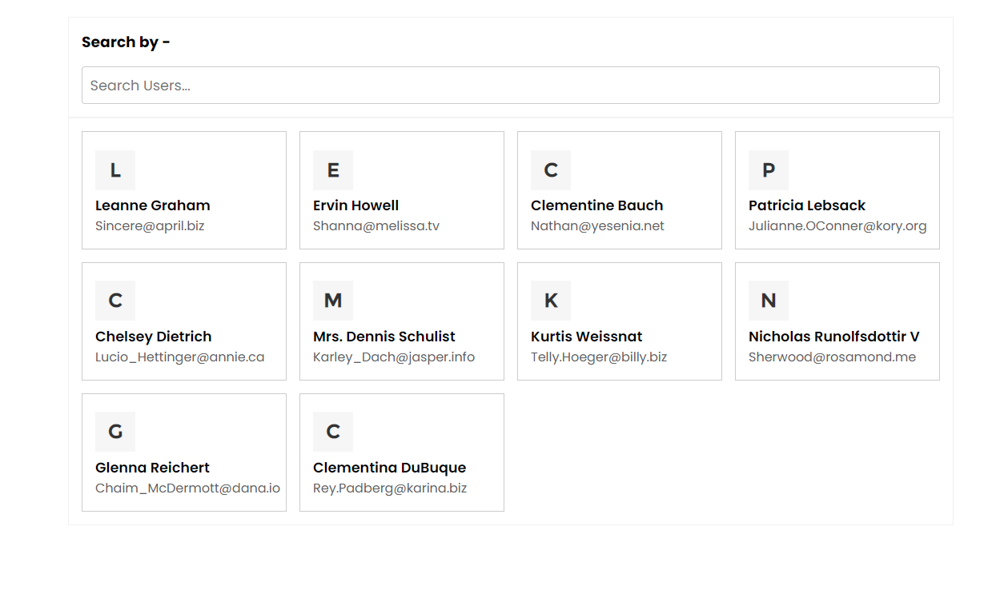

# Simple Search option in Vanilla JavaScript 

This is simple search functionality in javascript. This project inspired by ***Web Dev Simplified***. This very basic card design and also has a mailto option to mail particular users. If you have unique idea to made it very much better than now situtation. please feel free to clone it and do contributes 

## Using Technologies 
- HTML5/HTML
- CSS3/CSS
- Vanilla JavaScript.
- JsonPlaceholder API for User
- VS Code Editor
- Git bash/Github
and many more....

## Here is demo UI about my projects 

> Thanks for reachout me on github.